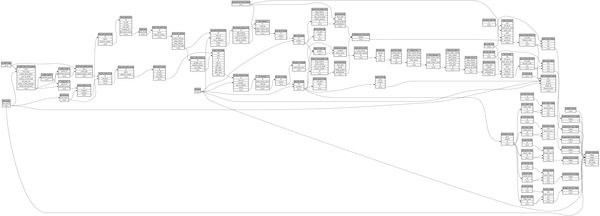

```
# AUTOGENERATED BY ECOSCOPE-WORKFLOWS; see fingerprint in README.md for details

```

```yaml
# fingerprint:
artifacts_sha256_basic: 
  c35f97852dfc34790b32b677ae841bc30d61cce57f3000994589a9b9a9f7aa63
artifacts_sha256_strict: 
  064506d7b837a5831150a284b9fb58ba25f8625ca28d7e4bb002949700665f84
installed_requirements:
- channel: https://repo.prefix.dev/ecoscope-workflows/
  name: ecoscope-platform
  version: {version: ==2.11.6}
- channel: https://repo.prefix.dev/ecoscope-workflows-custom/
  name: ecoscope-workflows-ext-custom
  version: {version: ==0.1.0rc4}
params_sha256: 01e1fe920e54cfd68e1f2bd7b5334cff6b0983e21b8ffea95009844c5c500dd4
spec_sha256: 07ee4c77cea856502c8e489c08498d47325e4da2f8d9881d8211a4286bae4670

```

# ecoscope-workflows-encounter-rate-workflow


