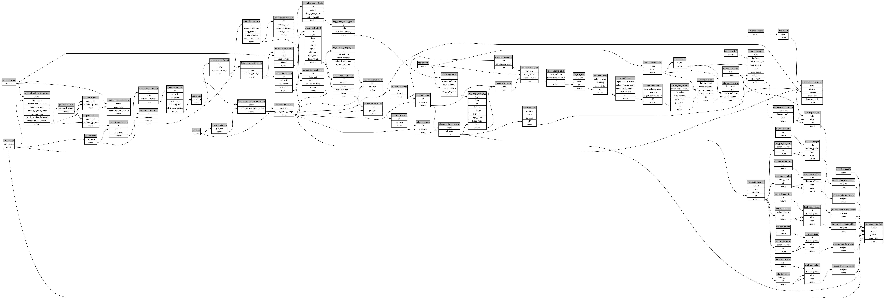

```
# AUTOGENERATED BY ECOSCOPE-WORKFLOWS; see fingerprint in README.md for details

```

```yaml
# fingerprint:
artifacts_sha256_basic: f94169cfbc2b8f21d49ed08a529e69aff74eba75c2bdfc1c3c838407cfad2d6f
artifacts_sha256_strict: 3af132cf38e609ca187716d83b3708ef63aab20b214b0f96adc28c22c9b485d4
installed_requirements:
- channel: https://repo.prefix.dev/ecoscope-workflows/
  name: ecoscope-platform
  version: {version: ==2.17.5}
- channel: conda-forge
  name: pydeck
  version: {version: ==0.9.2}
- channel: conda-forge
  name: setuptools
  version: {version: ==81.0.0}
params_sha256: 422e890f959e6bbd23040f7d9acf619dadf78cc00f39103ebff6458c366e3302
spec_sha256: b351e6cbf56a222b12f4161d3bcf52861b5efbb146645f65713b74d6b9bd81bd

```

# ecoscope-workflows-patrol-encounter-rate-map-workflow


